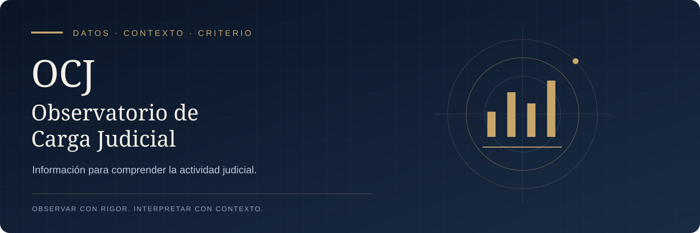

  

  <strong>Análisis de actividad judicial · Distribución documental · Interpretación responsable</strong>

  <a href="#el-observatorio">Proyecto</a> &nbsp;·&nbsp;
  <a href="#qué-permite-observar">Lectura de datos</a> &nbsp;·&nbsp;
  <a href="docs/METODOLOGIA.md">Criterios de interpretación</a> &nbsp;·&nbsp;
  <a href="#estado-del-repositorio">Estado</a>

---

## El Observatorio

**OCJ transforma registros de actividad judicial en información comprensible para analizar su distribución.** Su propósito es ayudar a formular mejores preguntas sobre el volumen documental, la composición de los procesos y el reparto de tareas.

Es un proyecto independiente de EJE Companion, con foco en el análisis y la visualización.

> **Igual cantidad de actuaciones no significa necesariamente igual carga de trabajo.** La complejidad, la urgencia y el tiempo de dedicación también importan.

## Qué permite observar

| Dimensión | Pregunta que ayuda a responder |
| :--- | :--- |
| **Volumen documental** | ¿Cuántas actuaciones se recuperaron para el período y el ámbito consultados? |
| **Expedientes únicos** | ¿En cuántos expedientes distintos se distribuye esa actividad? |
| **Terminaciones** | ¿Cómo se reparte el volumen según el último dígito del expediente? |
| **Tipos de proceso** | ¿Qué composición de asuntos hay detrás de las cantidades? |
| **Evolución temporal** | ¿Qué cambia entre períodos de duración y cobertura comparables? |

## Cómo leer los resultados

**1. Delimitar.** Identificar dependencia, período, fuente y unidad de conteo.

**2. Comparar.** Observar cantidades y proporciones, distinguiendo actuaciones de expedientes.

**3. Contextualizar.** Considerar registros sin clasificar, cobertura y diferencias entre tipos de proceso.

**4. Interpretar.** Evaluar qué sostiene la evidencia y qué requiere información adicional.

Los resultados basados en actuaciones públicas firmadas deben identificarse como tales: no equivalen automáticamente a escritos ingresados, expedientes nuevos ni horas de trabajo.

[Consultar los criterios de interpretación →](docs/METODOLOGIA.md)

## Estado del repositorio

Este repositorio contiene por ahora la **presentación del proyecto y sus criterios de lectura**. La incorporación del código fuente está pendiente; esta portada no acredita su respaldo, una versión ejecutable ni una actualización de la aplicación.

Las instrucciones de instalación y la documentación técnica se incorporarán después de verificar el código efectivamente alojado aquí.

---

  <strong>Observar con rigor. Interpretar con contexto.</strong> 
  OCJ · Proyecto de <a href="https://github.com/sinergiaestudio">Ariel Marcelo Gómez</a>

